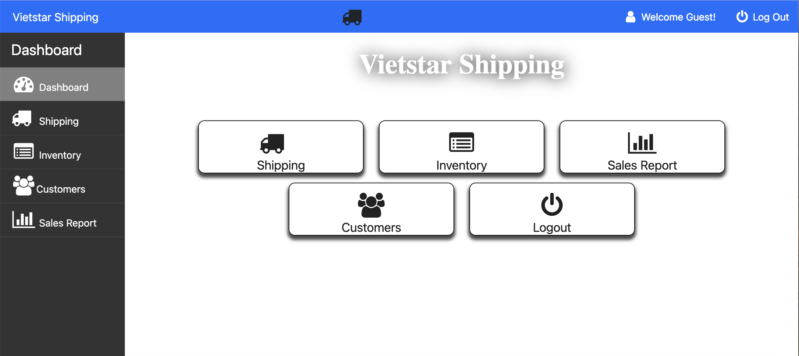

# Vietstar Shipping & Inventory Management System

**Current Version:** `v1.1.0`

## Executive Summary
**Vietstar Shipping** is a retail and logistics business providing international shipping services and in-store merchandise sales. This project represents a full digital transformation of the company’s legacy operations. 

By migrating from manual, paper-based workflows to a cloud web application, we successfully reduced shipping and inventory processing time by 48%, eliminated data redundancy, streamlined business operations, and provided management with sales analytics.



---

## Repository Structure
This repository contains two distinct components of the overall system:
* **`business_portal/` (Core Application):** The primary web application responsible for digitalizing the company's internal operations (shipping orchestration, inventory tracking, POS). *Note: The Live Demo, Docker containerization, and CI/CD pipelines are exclusively configured for this portal.*
* **`website/` (Public Facing):** The informational website designed to present the business and its services to retail customers.

---

## Live Demo (Business Portal)
* **Demo URL:** https://vietstarshipping.vanmuses.com
* **Guest Access:**
    * **Username:** `guest`
    * **Password:** `guest`
* *Note: Data is reset periodically. Some sample data is added for demonstration purposes.*

---

## Key Results & Impact
* **Operational Efficiency for Shipping:** Decreased customer wait times by nearly 50% during peak shipping seasons via digital shipping order orchestration.
* **Inventory Accuracy:** Centralized inventory management system that replaced physical ledgers with an automated tracking system, providing low-stock alerts and preventing service interruptions.
* **Sales Reports:** Developed a reporting engine that aggregates daily sales and shipping metrics, enabling data-driven inventory procurement.
* **Customer Management:** Centralized customer information and shipping history for better customer service.
* **Cost Optimization:** Reduced operational costs by eliminating manual processes and reducing errors.
---

## Tech Stack
* **Backend:** PHP (Vanilla)
* **Frontend:** HTML5, CSS3, Bootstrap, jQuery, AJAX
* **Database:** MySQL (Managed via AWS RDS)
* **Infrastructure:** AWS (EC2, RDS, Lightsail)
* **DevOps:** Docker, GitHub Actions, Linux/Apache

---

## Cloud Architecture & Modernization
To ensure the application is scalable, maintainable, and cost-effective, the infrastructure was recently modernized using cloud-native paradigms:

* **Containerization:** Packaged the application using Docker to guarantee environment parity across development and production environments.
* **Infrastructure as Code (IaC):** Utilized Terraform to systematically provision the application stack on AWS. This practice makes the infrastructure completely version-controlled, highly repeatable, and minimizes human error. It also allows developers to rapidly tear down environments when not in active use, drastically optimizing cloud costs.
* **Cloud Hosting:** Deployed to AWS Lightsail to provide a predictable, low-cost footprint optimized for small business operations while preserving high availability.
* **Data Tier:** Leveraged managed MySQL environments for automated backups, enhanced security, and robust storage scaling.
* **Real-time Error Monitoring:** Integrated Sentry to capture and aggregate runtime exceptions or fatal errors. This provides the development team with detailed stack traces the exact moment users experience an issue, ensuring bugs are diagnosed and fixed ASAP before impacting business operations.
* **CI/CD Pipeline:** Automated the deployment lifecycle using GitHub Actions. Upon merging to the main branch, a remote runner bundles the source code, securely transmits it to the AWS server via SCP, and executes a rolling Docker Compose update over SSH, ensuring zero-downtime releases.

---

## Key Features

### Inventory & Point of Sale (Business Portal)
* **Real-time Stock Deduction:** Automatically subtracts in-store items purchased within shipping orders from the central inventory database.
* **Barcode Integration:** Full barcode scanner compatibility for rapid product lookups during checkout and auditing.
* **Purchase Management:** Dedicated backend workflows and UIs for tracking incoming supply, featuring sequential, auto-incrementing invoice generation.
* **Dynamic Inventory UI:** Customized database-connected interfaces to monitor, update, and manage remaining stock.

### Digital Shipping Orchestration (Business Portal)
* **Order Management Dashboard:** Manages digital shipping orders and keep track of paid shipping orders.
* **Dynamic Form Auto-fill:** Generates digital shipping forms populated automatically using historical customer/recipient data.
* **Consignee Sync & Export:** Built-in scripts to export paid shipping orders into specialized data formats used to autofill the main Consignee’s external shipping portal.
* **Digital Invoicing:** Custom-designed UI for shipping invoices with direct-to-print functionality.

### Customer Relationship Management (Business Portal)
* **Centralized Directory:** Interfaced frontend and backend features to seamlessly add, edit, and maintain customer records and shipping histories.

### Sales & Business Intelligence (Business Portal)
* **Secure Executive Reporting:** Permission-gated dashboards (accessible solely by business owners) tracking daily revenue and overall profit margins based on shipping and inventory sales.
* **Printable Metric Reports:** Detailed reporting UIs with instant print functionalities for combined business performance.

### Customer Portal (Public Website)
* **Responsive Presentation:** A mobile-first, fully responsive public website showcasing Vietstar's available services.
* **Online Order Intake:** Features a digital submission form allowing customers to place shipping orders remotely. This data automatically syncs to the backend business portal allowing staff to update it as needed.

---

## Project Origins & Development 
This application originated as a collaborative capstone project engineered by a team of six developers over a two-semester cycle. The team successfully translated manual business workflows into technical specifications, designed the core database schema, and delivered the foundational prototype through agile methodologies.

### Continuous Modernization
Following the initial release, the application underwent significant modernization to prepare for a robust production environment. Ongoing continuous improvements include:
* **Codebase Refactoring:** Modernizing the PHP backend by resolving session management bugs, optimizing SQL data retrieval, and enforcing strict null-handling protocols for enhanced stability.
* **Infrastructure & DevOps:** Containerizing the application stack and migrating it to a resilient, cost-efficient AWS architecture, complete with automated CI/CD pipelines.
* **UI & Workflow Optimization:** Overhauling backend search queries (enabling asynchronous phone/email parsing via AJAX) and integrating responsive frontend libraries to accelerate daily data entry.

---

## Local Development Setup (Business Portal)

<details>
<summary>Click to expand setup instructions</summary>

### Prerequisites
* Docker & Docker Compose

### Installation
1.  **Clone the repository & navigate to the portal:**
    ```bash
    git clone https://github.com/your-username/vietstar-shipping.git
    cd vietstar-shipping/business_portal
    ```
2.  **Configure Environment:**
    Create a `.env` file in the `business_portal` directory and add your database credentials.
3.  **Launch via Docker:**
    ```bash
    docker-compose up --build -d
    ```
4.  **Access:**
    The application will be available at `http://localhost:8081`.

### Demo Data Management
To ensure a consistent demonstration experience, the database is initialized with professional seed data. If the data is modified during a demo and Needs to be reset:

1. **Stop the containers and remove the data volume:**
   ```bash
   docker-compose down -v
   ```
2. **Restart the stack:**
   ```bash
   docker-compose up -d
   ```
This will trigger the initialization scripts (`1_schema.sql` and `2_data.sql`) to recreate the database from scratch with the original test data.

</details>

---

## 📅 Version History & Changelog

### [1.1.0] - 2026-04-19 (Modernization Update)
**"Cloud-Native & Containerization"**
* **DevOps:** Containerized the entire stack using **Docker** and **Docker Compose**.
* **CI/CD:** Established **GitHub Actions** workflows for automated testing and deployment.
* **Code Quality:** Refactored legacy PHP session handling and optimized SQL queries for asynchronous AJAX searches.
* **Security:** Implemented environment variable management for sensitive database credentials.

### [1.0.0] - 2022-04-13 (Initial Release)
**"The Digital Transformation Foundation"**
* **Core:** Delivered the initial prototype of the Business Portal and Public Website.
* **Features:** Implemented basic shipping orchestration, inventory tracking, and POS functionality.
* **Collaboration:** Successfully completed the two-semester capstone engineering cycle.

---

## License
This project is licensed under the MIT License - see the LICENSE file for details.
